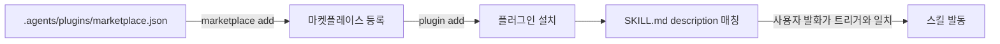

# LiveRockPlugins

화학공학 연구 업무용 Codex CLI 플러그인 마켓플레이스다.

마켓플레이스 매니페스트: [`.agents/plugins/marketplace.json`](.agents/plugins/marketplace.json)

## 설치

```
codex plugin marketplace add https://github.com/boogiu/LiveRockPlugins.git
codex plugin add liverock-toolkit@liverock
```

로컬 클론을 그대로 쓰려면 URL 대신 저장소 경로를 넘기면 된다.

갱신은 `codex plugin add`를 다시 실행하면 된다.

## 등록·설치·사용 흐름



## 플러그인 목록

| 플러그인 | 버전 | 설명 |
|---|---|---|
| [`liverock-toolkit`](plugins/liverock-toolkit/.codex-plugin/plugin.json) | 0.1.0 | 화학공학 연구 업무용. 현재는 스킬 작성 규격서만 있고 `skills/`는 비어 있다 |

## `liverock-toolkit` 스킬

아직 없다. 실제 연구 업무에서 반복되는 일이 무엇인지 확인한 뒤
[`references/skill-authoring.md`](plugins/liverock-toolkit/references/skill-authoring.md)의
규격에 맞춰 `skills/` 아래에 채운다.

스킬을 새로 만들거나 파일 구조를 바꿀 때는 그 문서를 먼저 읽는다. 구조·분량·frontmatter·
`description` 작성법과 제출 전 점검표가 전부 거기에 있다.
