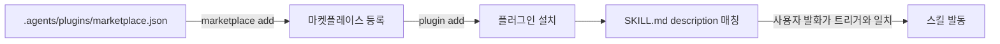

# LiveRockPlugins

화학공학 연구 업무용 Codex CLI 플러그인 마켓플레이스다.

마켓플레이스 매니페스트: [`.agents/plugins/marketplace.json`](.agents/plugins/marketplace.json)

## 설치

```
codex plugin marketplace add https://github.com/boogiu/LiveRockPlugins.git
codex plugin add liverock-toolkit@liverock
```

로컬 클론을 그대로 쓰려면 URL 대신 저장소 경로를 넘기면 된다.

갱신은 `codex plugin add`를 다시 실행하면 된다.

## 등록·설치·사용 흐름



## 플러그인 목록

| 플러그인 | 버전 | 설명 |
|---|---|---|
| [`liverock-toolkit`](plugins/liverock-toolkit/.codex-plugin/plugin.json) | 0.1.0 | 화학공학 연구 업무용. 연구 작업을 워커에 나눠 돌릴 때의 쿼터 예산·작업 분해·산출물 판정 |

## `liverock-toolkit` 스킬

| 스킬 | 하는 일 |
|---|---|
| [`research-orchestration`](plugins/liverock-toolkit/skills/research-orchestration/SKILL.md) | 연구 작업을 워커에 나눠 돌릴 때 쿼터 예산을 먼저 정하고, 작업을 쪼갤 단위를 고르고, 결과가 연구 산출물로서 맞는지 가릴 기준을 브리핑에 싣는다 |
| [`agent-orchestration`](plugins/liverock-toolkit/skills/agent-orchestration/SKILL.md) | Paseo로 워커를 실제로 기동한다 — 전제 점검, `create_agent`에 넣을 값 구성, 워커 브리핑, 결과·실패 파일 규약. 레벨 판정·큐 운영·재시도·검토 분리는 아직 없다(이식 진행 중) |
| [`literature-analysis`](plugins/liverock-toolkit/skills/literature-analysis/SKILL.md) | OpenAlex API로 논문을 탐색하고(신뢰 사이트 표시), 고른 논문을 워커에 나눠 읽혀 변인·분석 기법·결론을 추측 없이 정리한다 |
| [`experiment-planning`](plugins/liverock-toolkit/skills/experiment-planning/SKILL.md) | 화학공학 실험을 마일스톤 단위로 나누고 각 단계의 변인·측정 항목·판정 기준·선행 조건을 정한다 |

`research-orchestration`은 워커 기동·큐·재시도 같은 실행 절차를 직접 다루지 않는다. 그쪽은
`agent-orchestration`이 맡고, 이 스킬은 그 위에 얹는 쿼터 판단과 연구 도메인 판정만
담당한다. 둘을 함께 쓴다.

스킬을 새로 만들거나 파일 구조를 바꿀 때는
[`references/skill-authoring.md`](plugins/liverock-toolkit/references/skill-authoring.md)를
먼저 읽는다. 구조·분량·frontmatter·`description` 작성법과 제출 전 점검표가 전부 거기에 있다.
