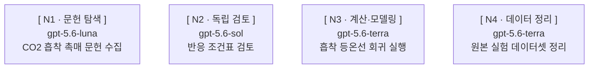

# 레벨 1 — 실행 기록·재개

## 레벨 1의 `GRAPH.md` 기록

레벨 1도 레벨 2와 **같은 `GRAPH.md` 규칙**을 쓴다.

- 경로: 실행 디렉터리 `.agents/orchestration/{YYYY-MM-DD}-{슬러그}/` 아래 `GRAPH.md`.
  날짜는 실행일의 `YYYY-MM-DD`, 슬러그는 이번 실행 전용 값이고 같은 경로가 이미 있으면
  슬러그를 바꾼다. **팀장은 `GRAPH.md`를 쓰기 전에 이 디렉터리를 만든다**(7절) — 없으면
  쓰기가 실패한다. 노드 결과 파일은 `nodes/{노드 ID}.md`, 실패 보고는
  `nodes/{노드 ID}.failure.md`다(7절). 단계 산출물은 실행 디렉터리 바로 아래
  `QUESTION.md` 하나뿐이고 연구 질문·제약·사용자 확정 사항을 담는다 — 그 밖의 산출물은
  예외 없이 `nodes/{노드 ID}.md`에 쓴다.
- 시점: 활성 큐의 각 노드를 `paseo run`으로 부르기 **전에** mermaid 블록과 그 노드의 행을
  쓴다. 각 호출 결과를 받는 **즉시** 그 노드 행의 `agentId`를 채운다. 이후 상태는 표의
  `상태` 열에서 갱신한다. 사용자가 실행을 중단하면 그 시점 상태로 즉시 갱신하고, 전원 판정을
  마친 완료 보고 시 최종 상태로 확정한다.
- 갱신 대상은 표의 `상태` 열이다. 범위 변경(합격 기준 변경·추가, 대상 파일 추가, 역할 변경,
  노드 추가·삭제, 되돌리기 어려운 작업 추가, 권한을 올리는 모드 변경)을 승인받아 실행 중인
  워커에 주입을 보냈으면, 보낸 **뒤에** 그 노드 행의 바뀐 칸을 함께 갱신한다. 승인을 받지
  못하면 주입을 보내지 않고 `GRAPH.md`도 바꾸지 않는다. mermaid 문자열은 상태 갱신으로
  고치지 않는다.
- 형식: 버전 줄·mermaid·노드 표의 서식과 열 집합은 7절 「`GRAPH.md` 서식」이 정한다. 노드
  ID는 9절 「설계」의 부여 규칙을 따른다 — 워커는 `N`, 제어는 `G`이고 접두별로 독립 번호를
  매기며 한 번 준 ID는 바꾸지 않는다. 다만 레벨 1 노드는 서로 의존하지 않으므로 mermaid에서
  노드 사이에 화살표(`-->`)를 그리지 않고 각 노드를 따로 나열한다. 견본은 아래 「실행 기록
  서식」에 있다. 각 행의 `agentId`는 그 노드의 `paseo run` 호출 결과를 받는 즉시 채운다 —
  아직 기동하지 않은 노드의 칸은 비워 둔다.
- **상태 값**은 7절이 고정한 다섯이다. `생략`은 판정이 생략인 단계로 워커를 만들지 않으며
  `paseo run` 대상이 아니다. `완료` → `실행 중` 역전이는 아래 「재작업 표기」의 경우에만
  일어나는 정상 전이다.
- **재작업 표기** — 이미 `완료`로 판정된 노드의 산출물을 다시 고쳐야 하면 레벨 2와 **같은
  표기**를 쓴다 — 그 노드의 `agentId`가 가리키는 에이전트 이름 끝에
  `paseo agent update <id> --name`으로 `(재작업)`을 접미로 붙이고, 동시에 표의 그 행 `상태`를
  `완료`에서 `실행 중`으로 되돌린다.
- 레벨 1도 재기동 `paseo run` 호출 **전에** 그 노드 행의 재시도 사용 횟수를 갱신한다 — 칸
  값의 형식은 7절이 정한다.
- 계획 승인 화면은 출력하지 않는다. 레벨 1에는 그 승인 게이트가 없다.
- `되돌리기` 열은 표에 남긴다. 값이 `예`인 노드는 승인 화면이 아니라 그 노드 기동 직전의
  별도 승인으로 처리한다(2절 — 「되돌리기 어려운 단위를 점검한다」).

## 실행 기록 서식

7절 「`GRAPH.md` 서식」이 정한 서식을 레벨 1에 채운 견본이다.

레벨 1(엣지 없는 팬아웃)은 작업 사이에 의존이 없으므로 노드 사이에 화살표를 그리지 않고 각
노드를 따로 나열한다. 아래는 활성 큐 기동을 마친 뒤의 견본이다 — 되돌리기 `예`인 N4는 기동
직전 별도 승인을 기다리므로 `대기`이고 `agentId`가 비어 있다.

````text
버전 : {플러그인 버전}



| 노드 ID | 종류 | 프로필 | 입력 | 결과 파일 | 합격 기준 | 진행 조건 | 워크스페이스 | 되돌리기 | 재시도 | 검토 라운드 | 게이트 | 상태 | agentId |
| --- | --- | --- | --- | --- | --- | --- | --- | --- | --- | --- | --- | --- | --- |
| N1 | 워커 | 문헌 탐색 — 문헌 수집 | QUESTION.md · 리더 브리핑 | nodes/N1.md / nodes/N1.failure.md | 출처가 확인되는 문헌 목록을 실제로 수집했는지 확인한다 | 즉시 | 공유(local) | 아니오 | 가능 · 한도 1 · 사용 0 | 해당 없음 | — | 실행 중 | 8f2a1c4e-3b6d-4a91-9c0e-1d2b3a4c5d6e |
| N2 | 워커 | 독립 검토 — 반응 조건표 검토 | QUESTION.md · 리더 브리핑 | nodes/N2.md / nodes/N2.failure.md | 원본 수용 조건을 모두 통과했는지 확인한다 | 즉시 | 공유(local) | 아니오 | 가능 · 한도 1 · 사용 0 | 상한 2 · 사용 0 | — | 실행 중 | 1a9b0c2d-4e5f-6789-abcd-ef0123456789 |
| N3 | 워커 | 계산·모델링 — 회귀 실행 | QUESTION.md · 리더 브리핑 | nodes/N3.md / nodes/N3.failure.md | 회귀를 실제로 실행한 결과와 적합도 지표가 있는지 확인한다 | 즉시 | 공유(local) | 아니오 | 불가 | 해당 없음 | — | 실행 중 | 2b0c1d3e-5f60-789a-bcde-f01234567890 |
| N4 | 워커 | 데이터 정리 — 데이터셋 정리 | QUESTION.md · 리더 브리핑 | nodes/N4.failure.md | 워커가 종료되었고 데이터셋 파일이 실제로 갱신됐는지 확인한다 | 즉시 | 공유(local) | 예 | 불가 | 해당 없음 | — | 대기 | |
````

판정 뒤에는 이 표의 변경된 셀만 갱신한다. 독립 노드는 진행 조건을 `즉시`로 둔다. 기동한
노드는 `실행 중`과 실제 `agentId`를 적고, 되돌리기 승인을 기다리는 노드는 `대기`로 두고
`agentId`를 비운다. 레벨 1에는 사용자 게이트 노드가 없으므로 `게이트` 열은 `—`다.

## 레벨 1 기동 보고

노드 표는 화면에 내지 않고 `GRAPH.md`에만 쓴다.

기본은 네 줄이고 라벨은 `이름` / `모델` / `모드` / `작업`이다. 라벨 뒤는 ` : `(공백-콜론-공백)다.
`이름`은 역할 이름, `작업`은 맡은 일 한 줄이다. `모델`은 `provider/model [ thinkingOptionId ]`이고
`paseo inspect <id> --json`의 확인값(`Provider`/`Model`·`Thinking`)을 쓴다. `모드`는
확인값(`Mode`)이고, 모드가 없는 프로바이더는 `없음`으로 쓴다. mermaid 라벨에는 모델명만,
기동 보고에는 provider/model과 thinkingOptionId를 쓴다.

```text
이름 : {이름}
모델 : {provider}/{model} [ {thinkingOptionId} ]
모드 : {Mode}
작업 : {맡은 일 한 줄}
```

워커 하나당 코드블록 하나다. 여러 개를 띄웠으면 블록을 연달아 놓고, 한 블록에 여러 건을 넣지
않으며 표로 바꾸지 않는다. **코드블록에 `기록` 줄을 붙이지 않는다** — `GRAPH.md` 경로는 실행당
한 번만 내고 워커 수만큼 반복하지 않는다.

레벨 1은 그 실행에서 **처음** 워커를 기동할 때만 코드블록들 앞에 목적 머리말 한 줄과
`GRAPH.md` 경로 한 줄을 낸다. 경로는 `기록 : ` 뒤에 쓴다. **mermaid 블록은 내지 않는다** —
그래프는 `GRAPH.md`에만 있다. 두 번째 이후 기동에는 그때 기동한 워커의 코드블록만 낸다.

목적 머리말은 `### 목적 — {한 문장}`으로 쓴다. 헤딩 단계는 `###` 그대로 두고, `— ` 뒤의
본문은 공백을 포함해 60자 이내의 한 문장이다. 60자를 넘으면 노드 목록·조건·산출물 이름·근거를
빼고 이번 실행이 무엇을 만드는지만 남기며, 줄을 바꾸어 두 줄로 만들지 않는다.

화면에 경로를 낼 때는 워크스페이스 루트 기준 상대 경로를 백틱으로 감싼다 —
`.agents/orchestration/2026-09-15-co2-sorbent/GRAPH.md`. 파일명만 쓰지 않고, 마크다운 링크로
만들지 않는다.

## 레벨 1 재개

리더 컨텍스트가 압축되거나 실행이 중단된 뒤 같은 요청을 이어받으면, 팬아웃을 처음부터 다시
설계하지 않고 아래 네 동작으로 이어 간다. 근거는 앞 「레벨 1의 `GRAPH.md` 기록」이 남긴 표다.

1. `paseo ls -g --json --label run={실행 디렉터리 이름}`으로 이전 실행에서 띄운 자식을
   조회한다. `run` 라벨은 기동할 때 붙인 값이다(4절).
2. 실행 디렉터리의 `GRAPH.md`를 읽어 기록된 `agentId`·결과 파일(`nodes/{노드 ID}.md`)·
   실패 보고 파일(`nodes/{노드 ID}.failure.md`)을 위 조회 결과와 대조한다. `agentId` 칸이
   비어 있으면 아직 기동하지 않은 노드다.
3. 실행 중이거나 `완료`인 노드는 재기동하지 않는다. 실행 중이면 종료를 기다리고, `완료`는
   표 기록만 믿지 않고 결과 파일과 합격 기준을 대조해 판정을 다시 세운다.
4. `대기` 노드는 기동한다. `실패` 노드는 재시도 조건과 잔여 횟수(10절)를 충족할 때만
   재기동한다. 기동은 3절 「레벨 1 — 팬아웃」의 활성 큐 규칙과 동시 실행 상한을 그대로 따른다 —
   상한 값은 `research-orchestration` 1절이 공급한다.

## 의존을 뒤늦게 발견하면

대기 중 작업이 실패한 앞 작업의 결과 파일을 필요로 한다는 것이 드러나면, 그것은 실패 처리가
아니라 **레벨 판정이 틀렸다는 신호**다.

1. 남은 대기 큐의 투입을 멈춘다. 실행 중인 워커는 중단하지 않고 결과를 받는다.
2. 발견한 의존 관계를 명시해 알린다. "레벨 1로 판정했는데 작업 N이 작업 M의 결과 파일을 필요로
   한다"까지 적는다.
3. 남은 작업은 2절 「레벨 판정 게이트」에 걸린다 — 레벨 2로 재판정해 9절로 간다. 순차로 다시 배열해
   레벨 1로 이어 가지 않는다.
4. 이미 완료된 작업은 다시 기동하지 않는다. 그 결과 파일 경로를 새 그래프의 스테이지 1
   입력으로 재사용한다.
