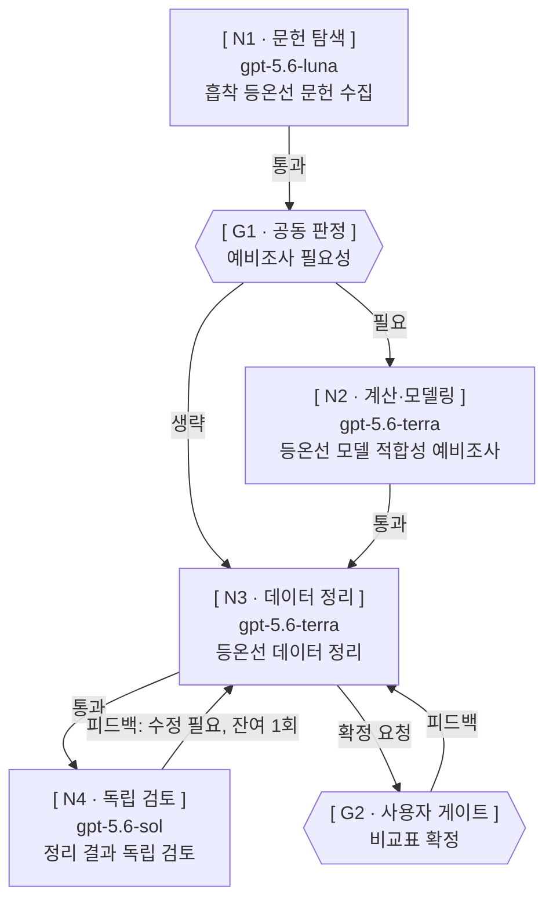

# 레벨 2 — 그래프 실행

2절에서 레벨 2로 떨어진 요청만 이 문서로 온다. 새 스케줄러나 실행 엔진을 만들지 않는다.
기동은 `create_agent`, 순서는 완료 알림과 아래 절차다. 값 이관은 4절, 브리핑은 5절,
검토 분리는 6절, 결과 파일 규약은 7절, 주입·실패 게이트는 10절이다.

같은 요청의 중단·압축 복구면 아래 「재개」로 간다. 새 요청이면 앞선 그래프를 재사용하지
않고 다시 설계한다.

## 설계

**접두는 노드 종류가 정한다** — 워커 노드는 `N1`, `N2` …, 제어 노드는 `G1`, `G2` …다.
`공동 판정`과 `사용자 게이트` 둘 다 `G`다. `노드1`은 쓰지 않는다. **`N`과 `G`는 서로 독립된
번호 공간이고, 한 번 부여한 ID는 실행 내내 그 노드를 가리키며 절대 바꾸지 않는다.** 실행 중
노드를 추가하면 **그 접두 안에서** 그 시점의 최대 번호 + 1로 뒤에 이어 붙이고, 비어 있는
중간 번호를 채우지 않는다. 삭제된 노드의 번호도 같은 접두에서 재사용하지 않는다. 실행
순서는 엣지가 정하므로 번호 순서와 실행 순서가 달라도 정상이다 — 실행 순서에 맞추려고 번호를
다시 매기지 않는다.

그래프 형태는 넷 중에서 고른다. **팬아웃**은 한 노드의 결과를 여러 노드가 나눠 받는 모양,
**팬인**은 여러 노드의 결과를 한 노드가 모으는 모양, **순차**는 앞 결과가 있어야 뒤가
시작되는 모양, **토론**은 같은 대상을 두 역할이 라운드로 주고받는 모양이다. 의존이 실제로
있는 곳에만 엣지를 그리고, 없는 의존을 만들어 순차로 늘리지 않는다.

그래프 모양은 `flowchart TD` mermaid다. 방향은 위에서 아래다. 같은 스테이지의 병렬
노드는 같은 앞 노드에서 갈라 나오게 그린다. `subgraph`로 뎁스를 묶지 않는다 — 의존은
노드끼리 화살표로 그린다. **노드 도형은 종류가 정한다** — 워커 노드는 직사각형
`N1["..."]`, 제어 노드는 육각형 `G1{{"..."}}`다. 라벨은 어느 쪽이든 따옴표로 감싼다.
이 둘 말고 다른 도형을 쓰지 않고, `style`·`click`을 쓰지 않는다.

라벨은 노드 종류에 따라 줄 수가 다르다. **워커 노드**는 세 줄이다 — 첫 줄
`[ 노드ID · 역할 ]`, 둘째 줄 모델명, 셋째 줄 작업 한 마디. **공동 판정·사용자 게이트 같은
제어 노드**는 두 줄이다 — 첫 줄 `[ 노드ID · 종류 ]`, 둘째 줄 판단 대상 또는 확정 대상.
어느 쪽이든 첫 줄은 대괄호로 감싸고 안쪽에 공백을 한 칸씩 둔다. 제어 노드는 워커가
아니므로 모델명과 `agentId`를 만들지 않는다 — 가짜 모델명이나 가짜 `agentId`를 넣지 않는다.
줄 구분은 `<br/>`다. mermaid 코드펜스 맨 위에 아래 프론트매터를 **필수**로 넣는다 —
없으면 긴 역할 이름이 재줄바꿈돼 행 구성이 깨진다.

```text
---
config:
  flowchart:
    wrappingWidth: 500
---
```

모델명은 `provider`를 뺀 값이고 thinking은 넣지 않는다. 나머지 속성은 아래 노드 표에만
둔다. 상태를 라벨에 넣지 않는다 — 표 갱신이 다이어그램 문자열 수정이 되어 문법이 깨진다.
계획 승인과 `GRAPH.md` 기록 모두 이 형식이다.

관계선은 한 줄에 하나씩 쓴다. 전달물·조건·반복 한도는 노드 설명이 아니라 관계선 라벨에
둔다. 되돌아가는 엣지는 `피드백:`으로 시작한다.

```text
N1 -->|통과| G1
G1 -->|필요| N2
G1 -->|생략| N3
N3 -->|확정 요청| G2
G2 -->|피드백| N3
N4 -->|피드백: 수정 필요, 잔여 1회| N3
```

- **사용자 왕복**은 작성 노드와 그 단계의 사용자 게이트 사이 **양방향 엣지**다 — 작성 노드 →
  게이트는 `확정 요청`, 게이트 → 작성 노드는 `피드백`이다. 상한이 없으므로 이 엣지 라벨에
  잔여 횟수를 적지 않는다.
- **검토 피드백**은 독립 검토 노드에서 작성 노드로 되돌아가는 엣지로 그리고, 라벨에 잔여
  라운드 한도를 적는다. 라운드가 늘어도 노드와 엣지는 그대로다 — 라운드마다 노드나 엣지를
  더 그리지 않는다. 그 엣지는 독립 검토 노드를 실제로 둔 경우에만 그린다 — 검토 → 작성
  되돌림 엣지를 사용자 왕복 자리에 쓰지 않는다.
- 노드 종류를 새로 만들지 않는다. `워커` / `공동 판정` / `사용자 게이트` 셋 그대로다.

**승인 화면의 mermaid에는 실행 중 팀장이 고를 수 있는 경로가 모두 그려져 있어야 한다.** 공동
판정의 `필요`·`생략` 두 엣지를 모두 그리고, 사용자 확정 게이트가 있는 단계는 작성 노드와
게이트 사이를 양방향으로 그리며, 독립 검토 노드를 두는 단계는 검토 → 작성 피드백 엣지와
잔여 라운드 한도를 그린다. 토론 라운드는 스테이지로 드러나게 그린다. 그려지지 않은 경로로
가는 것은 승인 밖이다.

승인 화면은 목적 머리말 → mermaid → `GRAPH.md` 경로 셋으로 끝난다 — 이 승인 화면은 레벨 2
한정이고 레벨 1에는 없다. **노드 표와 되돌리기 경고 줄을 승인 화면에 내지 않는다.** 노드별
입력·결과 파일·합격 기준·재시도·검토 라운드·게이트는 `GRAPH.md`에만 두고, 되돌리기 어려운
노드는 그 노드를 기동하기 **직전에** 별도 승인을 받는다(2절).

| 필드 | 내용 |
| --- | --- |
| 노드 ID | 워커는 `N1`, `N2` … / 제어는 `G1`, `G2` … — `N`과 `G`는 독립된 번호 공간이다(위 「설계」) |
| 종류 | `워커` / `공동 판정` / `사용자 게이트` 중 하나. mermaid 라벨의 줄 수와 도형도 이 종류를 따른다 |
| 프로필 | 역할과 그 역할에 실제 선택된 프로필 이름, 선택 근거 한 마디 |
| 입력 | 앞 노드 결과 파일 **경로** (스테이지 1은 `QUESTION.md`와 리더 브리핑) |
| 결과 파일 | 성공 결과 경로 + 실패 보고 경로 — 워커 브리핑(5절)에 준 경로와 같아야 한다. **단계 산출물은 예외**로 실행 디렉터리 바로 아래 `QUESTION.md` 하나뿐이고, 연구 질문·제약·사용자 확정 사항을 담는다 — 그 밖의 산출물은 예외 없이 `nodes/{노드 ID}.md`다. 실패 보고는 `QUESTION.md`를 쓰는 노드에도 예외 없이 `nodes/{노드 ID}.failure.md`다. 게이트 행에는 확정 대상 산출물 경로를 쓴다 |
| 합격 기준 | 팀장이 워커의 보고가 아니라 결과물을 직접 확인해 판정할 수 있는 한 줄이며, 결과 파일·실패 보고 파일의 존재·부재만으로 끝내지 않고 요청된 결과가 실제로 만들어졌는지를 담는다 |
| 진행 조건 | 다음 단계로 넘어가는 근거 — 선택된 분기, 검토 판정, 확정 근거 |
| 워크스페이스 | 공유(local) 또는 격리(worktree) |
| 되돌리기 | 예/아니오. 예면 그 노드 기동 직전 추가 승인(2절) |
| 재시도 | `불가` 또는 `가능 · 한도 1 · 사용 0`. 열을 늘리지 않는다. 한도와 사용 횟수는 이 셀에 적는다. 기동 재시도도 이 셀에 쓴다 |
| 검토 라운드 | `상한 2 · 사용 N` — 검토를 시작하기 전에 상한과 사용 횟수를 적는다. 총 2라운드는 최초 검토 1회와 재검토 최대 1회이고, **실제로 연 검토만** 사용 횟수에 센다. 라운드마다 노드를 늘리지 않고 이 칸으로 회차를 센다 |
| 게이트 | 그 단계의 사용자 확정을 기록한다 — **확정 대상 경로**, **검토 노드 ID**, **검토 시점 내용 해시**. 확정은 그 경로의 검토된 내용에만 유효하다. 그 단계에 독립 검토 노드를 두지 않았으면 검토 노드 ID 칸을 비운다 |
| 상태 | `대기` / `실행 중` / `완료` / `실패` / `생략`. 이 다섯 개만 쓴다. `생략`은 판정이 생략인 단계로, 워커를 만들지 않고 `create_agent` 대상이 아니다. **`완료` → `실행 중` 역전이는 이미 `완료`로 판정된 노드의 산출물에 재작업이 필요해진 경우에만 일어나는 정상 전이다**(아래 「재작업」) — 그 밖의 역전이는 없다. **사용자 게이트 행은 `대기` → `실행 중` → `완료`로 간다** — 게이트를 아직 열지 않았으면 `대기`, 팀장이 그 게이트를 열어 확정 요청 출력을 낸 시점에 `실행 중`, 사용자가 확정하면 `완료`다. 사용자 왕복이 도는 동안에도 그 행은 `실행 중`이고 왕복 횟수는 표에 적지 않는다. 게이트용 상태 값을 새로 만들지 않는다 |
| agentId | 각 `create_agent` 호출 결과를 받는 즉시 그 노드 행에 채운다. **제어 노드 행에는 `agentId`가 없고 채우지 않는다** — 비었다는 이유로 그 행의 상태를 `대기`로 되돌리지 않는다. 재작업 중 그 에이전트를 쓸 수 없어 새 에이전트로 갈아 끼우면(아래 「재작업」의 세 경우) 이 칸을 **새 ID로 덮어쓰고** 앞 에이전트의 ID를 함께 남기지 않는다. 값의 형식은 ID 하나다 |

- 같은 파일을 쓰는 노드는 격리하지 말고 그래프를 고쳐 순차로 둔다.
- 기본 워크스페이스는 1절에서 고른 공유 workspace다. worktree는 사용자가 명시할 때만.
- 토론 라운드는 기본 총 3라운드다. 연장은 횟수와 대상을 지정한 **사용자 결정**으로만 한다.
  설계 때 라운드를 스테이지로 드러나게 지정한다.
- **작성 노드와 독립 검토 노드의 왕복은 토론으로 배치해도 한도가 3이 아니라 검토 라운드
  상한 2다.** 그 왕복은 토론 라운드가 아니라 검토 라운드 예산을 소비하고 상한 2에서 멈춘다
  (아래 「두 예산」). 라운드를 2로 줄인 근거가 제한 플랜의 쿼터 예산이므로, 같은 왕복을 토론
  그래프로 그리는 것만으로 3라운드를 돌 수 있으면 그 예산이 아무것도 제한하지 못한다. 토론
  라운드 3은 작성↔검토가 아닌 대상에만 쓴다.
- 한 스테이지의 노드 수가 동시 실행 상한을 넘으면 3절 큐를 그 스테이지 안에서 그대로 쓴다.
  **상한 값은 `research-orchestration` 1절이 공급한다** — 이 문서에 숫자를 두지 않는다. 다만
  `GRAPH.md` 기록 갱신은 3절이 아니라 아래 「기록 시점」을 따른다.
- 게이트 행의 해시는 확정 시점에 검토된 내용을 가리킨다. 그 경로의 파일 내용이 바뀌면 그 확정과
  이를 전제로 한 **미기동** 단계만 보류한다. 이미 기동한 단계는 되돌리지 않는다.
- 확정과 해시 이력은 `GRAPH.md`의 게이트 행에만 남긴다. 별도 버전 이력 문서를 만들지 않는다.

### 작업 요청 처리 단계

레벨 2가 그리는 기본 단계는 여덟이다. 실제로 그리는 노드는 이 중 이번 요청에 걸리는 것만이다.

1. **연구 질문 확정** — 요청을 답할 수 있는 질문과 제약으로 좁혀 `QUESTION.md`에 쓴다.
2. **예비조사 필요성 공동 판정** — 제어 노드 `G`. 판정은 `필요`·`생략`·`정보 부족` 셋이다.
3. **예비조사** — 2가 `필요`일 때만 연다. `생략`이면 그 노드 상태는 `생략`이다.
4. **계획 필요성 공동 판정** — 제어 노드 `G`. 판정 값은 2와 같다.
5. **계획** — 4가 `필요`일 때만 연다.
6. **작업 분해** — 실행 노드로 나눈다.
7. **실행** — 문헌 탐색 / 논문 정독 / 데이터 정리 / 계산·모델링 / 시각화 / 실험 계획 역할이 맡는다.
8. **독립 검토 1회** — 6절 「검토 분리」의 세 조건을 지켜 연다.

### 공동 판정과 판정안

- 예비조사 필요성의 판정안은 무엇이 성립하지 않으면 뒤 작업이 통째로 버려지는지, 현재 근거,
  확인할 질문, 필요·생략·정보 부족을 담는다. 판정안은 실험 계획 역할이 쓴다.
- 계획 필요성의 판정안은 독립적으로 확인 가능한 중간 결과, 실제 순서 의존,
  필요·생략·정보 부족을 담는다. 파일 수·워커 수만으로 판정하지 않는다.

팀장은 판정안의 결론 한 줄과 핵심 쟁점만 읽고 대조한다. 불일치하면 그 차이만 그 역할에
되묻는다. 합의가 서기 전에는 분기를 고르지 않고, 연구 방향 선택이 남으면 사용자에게 올린다.

그 역할의 워커는 종료 요약에 판정(필요·생략·정보 부족)과 핵심 쟁점 한 줄만 남기고, 상세
근거는 결과 파일에 둔다. 팀장은 그 본문을 옮기지 않는다.

### 연구 질문 문답

- 한 번에 서로 독립된 결정 하나만 묻고, 답에 따라 결과·범위·수용 판정이 달라지는 미결정
  지점만 대상으로 한다. 주어진 근거로 답할 수 있는 것은 묻지 않는다.
- 중계하는 것은 질문과 답변뿐이고, `QUESTION.md` 본문과 작성자의 분석 과정은 옮기지 않는다.
- 사용자가 확정할 때까지 왕복 횟수에 상한을 두지 않는다. 검토 라운드 예산과는 별개다.

### 계획 생략과 연구 질문 변경

계획을 생략하면 팀장과 그 판정에 참여한 역할이 단일 작업 묶음임을 확정하고 계획 산출물 작성만
생략한다. 작업 분해 역할은 확정된 `QUESTION.md`를 직접 입력으로 받을 수 있다.

사용자 피드백으로 확정된 산출물이 바뀌면 승인된 내용만 반영하고, 영향을 받는 하위 단계를 다시
확인한다. 그 「다시 확인」은 **작성자 재확인**이다 — 영향을 받는 **미기동** 하위 단계의 전제와
입력을 그 단계 담당 역할이 다시 확인하는 것이고, 독립 검토 노드를 새로 기동하라는 뜻이 아니다.
그렇게 하려면 6절 「검토 분리」의 개설 조건에 걸려야 하고, 새 노드 추가이므로 승인 밖이다.
이미 기동한 단계는 되돌리지 않는다. 이 보류와 해제는 상태 전이이므로 기록만 하고 자발 발화로
내지 않는다.

## 계획 승인

워커를 하나라도 띄우기 **전에** 계획 승인을 **1회** 받는다. 읽기·조사만인 다단 그래프도
같다. 개별 노드 기동에 추가 계획 승인은 없다.

현재 대화에서 작업 범위·역할·실행 순서가 명시적으로 승인됐고 실행안이 그 내용과 같으면,
진행한다. 승인되지 않은 결정이나 승인 내용과 달라진 부분만 확인한다. 앞선 제안을 특정하는
"작업 시작해"는 그 제안의 승인이다. 다만 모호한 지시를 전체 계획 승인으로 확대하지 않는다.

그 승인이 아직 없으면 **목적 머리말 → mermaid → `GRAPH.md` 경로** 순으로 **일반 응답으로
출력하고 턴을 마쳐** 사용자 답변을 기다린다. 이 순서는 고정이고 화면은 이 셋으로 끝난다.
서식은 아래 「승인 화면 서식」이 고정한다. mermaid 전체 검토가 필요하므로 이 승인 요청은
질문 도구의 짧은 선택지로 대체하지 않는다. 무응답·주제 전환은 승인이 아니다. 승인 전에
`create_agent`를 호출하지 않는다.

- 목적 머리말은 mermaid 밖에 `### 목적 — {한 문장}`으로 둔다. 헤딩 단계는 `###` 그대로 두고,
  `— ` 뒤의 본문은 공백을 포함해 60자 이내의 한 문장이다. 60자를 넘으면 노드 목록·조건·
  산출물 이름·근거를 빼고 이번 실행이 무엇을 만드는지만 남기며, 줄을 바꾸어 두 줄로 만들지
  않는다. mermaid 안에 넣으면 스타일을 못 준다.
- **되돌리기 경고 줄과 노드 표를 내지 않는다.** 노드별 입력·결과 파일·합격 기준·재시도·
  검토 라운드·게이트는 `GRAPH.md`에만 둔다. 되돌리기 어려운 노드는 승인 화면에 적지 않고
  그 노드 기동 **직전의** 별도 승인으로 받는다(2절). 재시도·워크스페이스 등 다른 예외도
  올리지 않는다.
- `GRAPH.md` 경로는 `기록 : ` 뒤에 쓴다. 화면에 경로를 낼 때는 워크스페이스 루트 기준 상대
  경로를 백틱으로 감싼다. 파일명만 쓰지 않고, 마크다운 링크로 만들지 않는다.

형태가 바뀌는 재설계와 범위 변경 주입은 다시 승인받는다.

### 승인 화면 서식

계획 승인 요청 때 출력하는 화면이다. mermaid에는 실행 중 고를 수 있는 경로가 모두 그려져
있어야 한다 — 공동 판정의 `필요`·`생략` 두 엣지, 작성 노드와 사용자 게이트 사이의 양방향
엣지(`확정 요청`·`피드백`), 독립 검토 노드를 실제로 둔 단계의 검토 → 작성 피드백 엣지와
잔여 라운드 한도.

````text
### 목적 — CO2 흡착제 후보를 문헌 값으로 비교한 표를 만든다



기록 : `.agents/orchestration/2026-09-15-co2-sorbent/GRAPH.md`
````

### 승인 그래프와 승인 안·밖

계획 승인은 mermaid 그래프 하나를 승인받는 것이다. **승인 그래프가 규정하는 넷이 실행 중
그대로면 승인 안이고, 하나라도 달라져야 진행할 수 있으면 승인 밖이다.**

1. **노드 집합** — 각 노드의 노드 ID, 종류(`워커`·`공동 판정`·`사용자 게이트`), 역할, 대상.
2. **엣지 집합** — 노드 사이의 모든 관계선. 분기 엣지(`필요`·`생략`), 작성 노드와 게이트
   사이의 양방향 엣지, 검토 노드에서 되돌아가는 피드백 엣지, 각 엣지 라벨의 조건과 반복 한도.
3. **한도** — 각 노드의 재시도 한도, 검토 라운드 상한, 토론 라운드 수. 사용자 왕복은 상한이
   없으므로 한도에 들지 않는다.
4. **되돌리기 표시** — 어느 노드가 되돌리기 어려운 행동을 하는가. 이 표시는 노드 표에만 있고
   승인 화면에 나오지 않으므로, 이것이 달라질 때 받는 승인은 계획 승인이 아니라 그 노드
   기동 직전의 별도 승인이다.

아래는 전부 **승인 안**의 진행이다. 새 승인도, 자발 발화도 없이 `GRAPH.md`만 갱신한다 —
사용자 왕복(횟수 상한이 없어 몇 번을 돌아도 승인 밖이 되지 않는다. 중계 출력 자체는 즉시
발화다), 잔여 라운드 안의 검토 피드백 루프(재검토는 **같은 검토 노드**가 돈다 — 라운드마다
노드를 만들지 않으므로 노드 추가가 아니다), 승인 그래프에 두 엣지가 있는 공동 판정의
`필요`·`생략` 분기, 위 「작성자 재확인」 범위의 하위 단계 재확인, 상태 전이(`대기`→`실행 중`
→`완료`/`실패`/`생략`, 그리고 재작업에 따른 `완료`→`실행 중` 역전이 — 아래 「재작업」),
`agentId` 채움, 한도 안의 재시도·검토 라운드 사용 횟수 증가, 게이트 행 갱신.

아래는 전부 **승인 밖**이다. **실행하기 전에** 즉시 발화로 올리고, 사용자 답을 받기 전에는
그 변화를 실행하지 않는다.

1. 승인 그래프에 없는 노드·단계를 추가한다. **독립 검토 노드를 새로 두는 것과, 재작업에서
   역할이 달라져 새 노드를 만드는 것이 여기 해당한다.** 추가하는 노드의 ID는 설계 절의 부여
   규칙을 따른다. 이미 승인된 검토 노드가 2라운드를 도는 것은 노드 추가가 아니므로 이 항에
   들지 않는다.
2. 승인 그래프에 있는 노드를 삭제한다.
3. 승인 그래프에 그려지지 않은 경로로 진행한다.
4. 노드의 역할이나 대상을 바꾼다.
5. 노드의 프로필을 다른 것으로 대체한다.
6. 검토 라운드 상한, 토론 라운드 수, 재시도 한도를 연장한다. 사용자 왕복은 상한이 없으므로
   이 항에 들지 않는다.
7. 되돌리기 표시가 없던 노드에 되돌리기 어려운 행동을 추가한다. 이때 받는 것은 그 노드 기동
   직전의 별도 승인이고, 계획 승인을 다시 받는 것이 아니다.
8. 워커의 권한을 올린다.
9. 합격 기준을 바꾸거나 더한다.
10. 대상 파일을 추가한다.
11. 레벨 1로 판정했던 실행을 레벨 2로 재판정한다.

승인 안인지 밖인지 판정이 갈리면 **승인 밖으로 본다.**

올릴 때는 셋을 담는다 — 무엇이 승인 그래프와 달라지는가(위 넷 중 어느 것이 어떻게), 그
변화가 필요해진 사건, 승인하지 않을 경우 남는 선택지. 설계 과정과 후보 비교는 담지 않는다.
그래프 형태 자체가 바뀌는 재설계는 계획 승인을 다시 받고, 형태가 그대로인 변화는 그 변화만
승인받고 새 계획 승인 화면을 내지 않는다.

## GRAPH.md

레벨 2는 항상 만든다 — 레벨 1도 같다. 생성 자체는 승인 대상이 아니고, 레벨 2는 승인 요청에
**기록 파일을 쓸 것과 그 경로를** 알린다.

경로: 7절에서 정한 실행 디렉터리 `.agents/orchestration/{YYYY-MM-DD}-{슬러그}/`의
`GRAPH.md`. 날짜는 실행일의 `YYYY-MM-DD`, 슬러그는 이번 실행 전용 값이고 같은 경로가 이미
있으면 슬러그를 바꾼다. 노드 결과 파일은 `nodes/{노드 ID}.md`, 실패 보고는
`nodes/{노드 ID}.failure.md`다. 나머지 결과 파일 규칙은 7절과 같다.

`GRAPH.md`는 mermaid 1개와 노드 표 1개만 둔다 — 갱신은 그 블록을 고치는 것이고 새 갱신본을
뒤에 덧붙이는 것이 아니다. 노드 추가·승인된 구조 변경은 mermaid와 표에 함께 반영한다.
**이 「mermaid 1개와 노드 표 1개만」 규칙의 예외는 맨 위 버전 줄 하나뿐이다**(아래 「버전 줄」).

### 버전 줄

`GRAPH.md` **맨 위, mermaid 블록보다 위**에 이 스킬이 속한 플러그인의 버전을 한 줄로 적는다.
그 `GRAPH.md`가 어느 버전의 규칙으로 만들어졌는지 나중에 판단하는 것이 이 줄의 용도다.

- 표기는 `버전 : {플러그인 버전}`이다 — 라벨 `버전`, 구분자 ` : `(공백-콜론-공백).
  확정된 견본은 아래 「실행 기록 서식」에 있다.
- **버전 값을 이 스킬 문서에 하드코딩하지 않는다.** 플러그인 루트의 `plugin.json` `version`
  필드에서 읽는다 — 경로는 스킬 디렉터리(`skills/agent-orchestration/`) 기준 상대 경로
  `../../.codex-plugin/plugin.json` 하나다.
- **값을 읽지 못하면** 그 사실이 드러나게 그 줄에 적고(`버전 : 읽지 못함`) 실행을 멈추지
  않는다. 그 줄 때문에 기동을 보류하지 않는다. **임의의 버전 값을 추측해 적지 않는다.**
- 이 줄은 `GRAPH.md`를 **만드는 시점에** 쓴다. 이후 상태 갱신에서 다시 쓰지 않는다.
- **이미 만들어져 버전 줄이 없는 `GRAPH.md`는 그대로 둔다.** 소급 적용하지 않고, 그런 기존
  파일을 찾아 고치지도 않는다.

### 기록 시점

자발 발화를 하지 않는 것은 기록을 미루는 근거가 되지 않는다.

1. **`create_agent` 호출 전에** 그 노드 행을 쓴다. 계획이 확정된 실행은 mermaid 블록과 노드
   행을 먼저 쓴다 — 합격 기준·결과 파일·실패 보고 경로·재시도 한도·검토 라운드 상한과 사용
   횟수를 표에 그대로 둔다. 각 호출 결과를 받는 **즉시** 그 노드 행의 `agentId`를 채운다.
2. 재시도 사용 횟수는 재기동 `create_agent` 호출 **전에** 올린다.
3. 검토 라운드 사용 횟수는 검토를 시작하기 **전에** 올린다.
4. 재작업으로 상태를 `완료`에서 `실행 중`으로 되돌리는 기록은 **재지시를 보내기 전에** 한다.
5. 노드 판정은 확인 **즉시** 상태 열에 반영한다. 공동 판정·분기 결정 시점에도 표를 갱신하고,
   변하는 상태 문자열은 표에만 두고 mermaid에는 넣지 않는다.
6. 사용자 게이트를 여는 시점과 확정을 받은 시점에 그 게이트 행을 갱신한다(위 `상태` 행).
7. 승인받은 범위 변경 주입을 보낸 **뒤** 그 노드 행을 갱신한다.
8. 사용자가 실행을 중단하면 그 시점 상태로 **즉시** 갱신한다. 스테이지 경계는 다음 단계를
   기동할지 판단하는 시점이다.

### 실행 기록 서식

`GRAPH.md`에 두는 mermaid와 노드 표다. 아래는 스테이지 하나를 기동하고 `G1`이 `생략`으로
판정된 뒤의 견본이다. 맨 위 `버전 : ` 줄은 위 규칙이 정한 자리이고, 이 견본이 그 표기(라벨
`버전`, 구분자 ` : `)를 고정한다.

````text
버전 : {플러그인 버전}


| 노드 ID | 종류 | 프로필 | 입력 | 결과 파일 | 합격 기준 | 진행 조건 | 워크스페이스 | 되돌리기 | 재시도 | 검토 라운드 | 게이트 | 상태 | agentId |
| --- | --- | --- | --- | --- | --- | --- | --- | --- | --- | --- | --- | --- | --- |
| N1 | 워커 | 문헌 탐색 — 흡착 등온선 문헌 수집 | QUESTION.md · 리더 브리핑 | nodes/N1.md / nodes/N1.failure.md | 출처가 확인되는 등온선 문헌 목록을 실제로 수집했는지 확인한다 | 즉시 | 공유(local) | 아니오 | 가능 · 한도 1 · 사용 0 | 해당 없음 | — | 완료 | 8f2a1c4e-3b6d-4a91-9c0e-1d2b3a4c5d6e |
| G1 | 공동 판정 | — | nodes/N1.md | — | 팀장과 실험 계획 역할의 판정이 일치했는지 확인한다 | N1 완료 · 판정 생략 | 공유(local) | 아니오 | 불가 | 해당 없음 | — | 완료 | |
| N2 | 워커 | 계산·모델링 — 모델 적합성 예비조사 | nodes/N1.md | nodes/N2.md / nodes/N2.failure.md | 판정 기준과 중단 기준을 정하고 적합도를 실제로 계산했는지 확인한다 | G1 필요 | 공유(local) | 아니오 | 가능 · 한도 1 · 사용 0 | 해당 없음 | — | 생략 | |
| N3 | 워커 | 데이터 정리 — 등온선 데이터 정리 | nodes/N1.md | nodes/N3.md / nodes/N3.failure.md | 문헌 값이 단위까지 맞춰 비교표로 정리됐는지 확인한다 | G1 생략 | 공유(local) | 아니오 | 불가 | 해당 없음 | — | 실행 중 | 2b0c1d3e-5f60-789a-bcde-f01234567890 |
| N4 | 워커 | 독립 검토 — 정리 결과 독립 검토 | nodes/N3.md | nodes/N4.md / nodes/N4.failure.md | 원본 수용 조건을 모두 통과했는지 확인한다 | N3 완료 | 공유(local) | 아니오 | 가능 · 한도 1 · 사용 0 | 상한 2 · 사용 0 | — | 대기 | |
| G2 | 사용자 게이트 | — | nodes/N3.md · nodes/N4.md | nodes/N3.md | 확정 대상 경로와 검토 시점 내용 해시를 적었는지 확인한다 | N4 통과 | 공유(local) | 아니오 | 불가 | 상한 2 · 사용 0 | nodes/N3.md · N4 · 확정 대기 | 대기 | |
````

판정 뒤에는 이 표의 **변경된 셀만** 갱신한다. 예를 들어 N3이 통과하고 N4를 기동했으면
N3 행은 `상태 = 완료`, N4 행은 `상태 = 실행 중`·`agentId = {받은 ID}`·
`검토 라운드 = 상한 2 · 사용 1`이고, 나머지 셀과 다른 행은 그대로 둔다.

사용자 게이트 행의 `상태`는 세 단계를 지난다 — 게이트를 열기 전에는 위 견본처럼 `대기`이고,
팀장이 그 게이트를 열어 확정 요청 출력을 낸 시점에 `실행 중`, 사용자가 확정하면 `완료`다.
게이트용 상태 값을 새로 만들지 않고, 제어 노드 행의 `agentId`는 비워 둔다.

## 실행

### 단계 전이

한 단계는 아래 순서대로 간다.

1. 작성 워커가 그 단계의 대상 산출물을 **작성 완료**한다.
2. 결정이 필요한 질문이 있으면 팀장이 사용자에게 중계하고, 사용자 답변을 같은 작성 워커에게
   전달해 고치게 한다. **이 왕복은 사용자가 확정할 때까지 상한이 없다.**
3. 사용자가 **명시적으로 확정한 뒤에** 다음 단계를 **기동**한다.

이 셋에 독립 검토 노드는 들어가지 않는다 — **검토 통과가 사용자 확정을 대신하지 않는다**는
규칙은 독립 검토 노드를 실제로 둔 단계에만 적용된다.

### 검토를 여는 경우

독립 검토의 개설 조건은 6절 「검토 분리」를 따른다. 검토 워커는 작성 워커와 다른 `agentId`
여야 하고, 작성자의 대화·보고가 아니라 원본 합격 기준과 대상 경로만 입력으로 받는다.

### 두 예산 — 사용자 왕복과 검토 라운드

| | 사용자 왕복 | 검토 라운드 |
| --- | --- | --- |
| 누구와 누구 사이인가 | 사용자 ↔ 작성 워커 | 작성 워커 ↔ 독립 검토 워커 |
| 상한 | **없다** | **총 2회** — 최초 검토 1회 + 재검토 최대 1회 |
| 언제 세는가 | 세지 않는다 | 실제로 연 검토만 센다 |
| 서로 소비하는가 | 아니다 | 아니다 |

사용자 왕복이 몇 번을 돌아도 검토 라운드 예산은 줄지 않고, 검토 라운드를 다 써도 사용자
왕복은 계속할 수 있다. 검토 라운드를 실제로 도는 왕복은 검토 노드가 지적한 **경로를 그대로**
작성 워커에게 전달하고, 작성 워커가 수정한 뒤 **같은 절차로 재검토**한다. 검토 예산은 총
2회이고, 검토 실패의 세 갈래(대상 불합격 / 환경 미수행 / 검토자 실패)와 그 각각이 라운드를
소비하는지는 10절이 정한다.

**작성 워커 ↔ 독립 검토 워커 왕복은 그래프에 어떤 모양으로 그려도 이 상한 2를 따른다.** 그
왕복을 토론 그래프로 배치해도 토론 라운드 한도 3(위 「설계」)이 아니라 이 상한 2가 우선하고,
그 왕복은 검토 라운드 예산을 소비한다. 상한을 2로 정한 근거가 제한 플랜의 쿼터 예산이라,
그래프 형태를 바꾸는 것만으로 한도가 늘어나면 그 예산이 의미를 잃기 때문이다. 토론 라운드
한도 3은 작성↔검토가 아닌 대상에만 적용된다.

새 요구사항이 생겨도 검토 예산을 자동으로 초기화하지 않으며, 예산의 연장은 횟수와 대상을 정한
사용자 결정으로만 한다. 상한을 소진했는데 지적이 남으면 결론을 지어내지 않고 즉시 발화로
올린다. 사용자가 요청했거나 팀장이 대상을 지정해 연 검토도 같은 상한과 같은 사용 횟수 셈을
따른다.

- **검토를 여러 라운드 도는 단계에도 검토 노드는 하나다.** 라운드마다 별도 노드 ID를 만들지
  않는다. 회차는 그 노드 행의 `검토 라운드` 칸(`상한 2 · 사용 N`)으로 센다.
- 라운드마다 **결과 파일 이름만** 나눈다 — 1라운드는 `nodes/{노드 ID}.md`, 2라운드는
  `nodes/{노드 ID}.round2.md`이고, 실패 보고도 같은 방식으로
  `nodes/{노드 ID}.round2.failure.md`다. 앞 라운드의 파일을 덮어쓰거나 지우지 않으며,
  다음 검토가 앞 라운드의 결과 경로를 참조할 수 있다.
- 계획 승인 1회는 실행 구조의 승인일 뿐 미작성 산출물 내용의 확정이 아니다. 승인된 분기와
  라운드 범위 안의 전이는 재설계가 아니다. 새 단계·새 범위·상한 연장만 새 승인 대상이다.

### 기동과 판정

1. **기동 전에** 7절의 결과 파일·실패 보고 경로 분리를 확인한다 — 같으면 분리하기 전까지
   기동하지 않는다. 승인된 한 스테이지의 `대기` 노드를 기동한다. 동시 실행 상한과 FIFO는
   3절과 같고, 상한 값은 `research-orchestration` 1절이 공급한다.
2. 완료 알림 대기는 3절과 같다.
3. **종료와 합격 기준 통과를 나누어 판정한다.** 실패 보고 경로에 내용이 있으면 `실패`다.
   그다음에야 결과 파일과 합격 기준을 대조한다. 에이전트가 멈춘 것만으로 `완료`가 아니다.
4. **선택된 경로의 활성 노드가 통과하고 필요한 사용자 게이트가 확정되면 진행한다.**
   `생략`은 차단 원인이 아니다. 하나라도 `실패`면 그 노드에 의존하는 노드는 기동하지 않는다.
5. 뒤 노드 브리핑에는 앞 노드 결과 파일의 **경로만** 넣는다. 본문을 붙이지 않는다. 연구 질문·
   제약·사용자 확정 사항이 필요하면 실행 디렉터리 바로 아래 `QUESTION.md`의 실제 경로를 넣는다.
6. 검토 노드의 브리핑은 6절이 정한 분리 조건을 지킨다.
7. 실행 중 `agentId`가 있으면 그 ID로 상태를 조회한다. **이 금지가 겨냥하는 것은 같은
   노드를 실수로 두 번 띄우는 중복 기동이다** — 살아 있거나 이미 끝난 노드를 그것을 모른 채
   다시 기동하지 않는다. **의도한 재작업은 이 금지의 대상이 아니다** — 그때는 아래 「재작업」의
   절차를 따른다. 생성 결과가 불명이면 조회부터 하고 중복 기동하지 않는다.
8. 주입과 실패 게이트는 10절이다. 범위 변경·재설계는 보내기 전에 승인을 받는다. 호스트가
   실행 중 메시지를 막으면 보내지 않고 보고한다.

### patch 왕복

**최초 작성 라운드는 예외**다 — 기준 파일이 없으므로 작성 워커가 산출물을 직접 쓴다.
2라운드에서 작성 워커는 대상 산출물을 직접 고치지 않고, 같은 실행 디렉터리에
`{산출물 이름}.round2.patch` **하나**를 낸다.
**재작업도 예외**다 — 재작업은 검토 라운드가 아니라 라운드 번호가 없으므로, 재작업 지시를
받은 워커는 patch를 내지 않고 대상 산출물을 **직접 고친다**(아래 「재작업」).

- 팀장은 `git apply`로 그 patch를 **본문을 읽지 않고** 기계적으로 적용한다. 실행 디렉터리가
  git 추적 대상이 아니어도 `git apply`는 작업 트리 파일에 동작하므로, 추적 여부를 이 규칙의
  우회로 쓰지 않는다.
- 깨끗하게 적용되지 않으면 그 라운드는 실패한다. 이 실패는 검토 라운드가 아니라
  **기동 재시도 예산**을 소비한다.
- 이전 판본 사본을 만들지 않는다 — 라운드마다 남는 파일이 곧 그 라운드의 판본이다.

### 재작업

이미 `완료`로 판정된 노드의 산출물을, 후속 노드를 진행하다 다시 고쳐야 할 때가 있다.
**기본 동작은 그 노드를 수행했던 기존 에이전트에 `send_agent_prompt`로 다시 지시하는
것이다.** 새 `create_agent` 호출이 아니고, **노드 ID를 바꾸지 않으며 새 노드도 만들지 않는다.**

- 그 노드 행의 상태를 표에서 `완료`에서 `실행 중`으로 되돌린다. 이 역전이는 정상 전이이고
  승인 안이다(위 「승인 그래프와 승인 안·밖」). `GRAPH.md`만 갱신하고 계획 승인을 다시 받지
  않는다.
- 이 상태 되돌림은 **재지시를 보내기 전에** 기록한다(위 「기록 시점」).
- 재지시 내용이 주입 게이트의 **범위 변경**(합격 기준의 변경·추가, 대상 파일 추가, 역할 변경,
  되돌리기 어려운 행동 추가, 권한을 올리는 모드 변경)에 해당하면 **보내기 전에** 승인을 받는다
  — 10절 주입 게이트가 재작업에도 그대로 적용된다.
- 재작업은 검토 라운드가 아니므로 patch를 내지 않고 대상 산출물을 직접 고친다(위
  「patch 왕복」).

**표기 — 재작업 중인 노드는 이름 접미와 상태 복원으로 나타낸다.**

- 그 노드의 `agentId`가 가리키는 에이전트 이름 끝에 `(재작업)`을 접미로 붙인다. 이름을 바꾸는
  수단은 Paseo 도구 `update_agent`의 `name` 인수다. 문구는 정확히 `(재작업)`이고 **회차
  숫자를 붙이지 않는다.**
- 동시에 표의 그 행 `상태`를 `완료`에서 `실행 중`으로 되돌린다.
- 재작업이 끝나 그 노드를 다시 `완료`로 판정해도 **접미를 떼지 않고 그대로 둔다** — 이름을
  되돌리는 호출을 더하지 않는다. 같은 노드가 다시 재작업으로 들어갈 때 이미 `(재작업)`이 붙어
  있으면 **겹쳐 붙이지 않는다.**
- 상태 값은 `대기`·`실행 중`·`완료`·`실패`·`생략` 다섯 그대로다 — 여섯 번째 값을 만들지
  않는다. **mermaid를 건드리지 않고**(노드 라벨·엣지 그대로), **노드 표의 열도 늘리지
  않는다**(재작업용 열·칸 없음). 이 표기는 표의 값이 아니라 에이전트 이름에만 붙으므로 열
  집합과 상태 값은 그대로다.
- `agentId`가 있는 워커 노드에만 적용한다. 제어 노드 행에는 에이전트가 없으므로 이 표기가 없다.
- 재작업한 노드와 그 사실은 아래 「완료 보고」에 넣는다.

**새 에이전트로 갈아 끼우는 경우는 셋뿐이다.**

1. 그 에이전트가 `closed`·`error` 상태라 프롬프트를 받을 수 없다.
2. 실패 원인이 그 워커의 전제 자체여서, 같은 맥락으로 다시 시키면 같은 결과가 반복된다.
3. 역할이 달라진다.

- 앞 둘(1·2)은 **같은 노드 ID를 그대로 쓰고 그 행의 `agentId` 칸만 새 ID로 교체한다.** 노드를
  추가하지 않는다.
- 셋째(3)만 **새 노드**다. 새 노드의 ID는 그 접두(`N` 또는 `G`) 안에서 그 시점의 최대 번호 + 1로
  뒤에 이어 붙이고, 비어 있는 중간 번호나 삭제된 번호를 재사용하지 않는다(위 「설계」).
- 셋째는 승인 그래프에 없는 노드를 추가하는 것이므로 **승인 밖**이다 — 기동하기 전에 사용자
  승인을 받는다(위 「승인 그래프와 승인 안·밖」).
- **이 셋 밖의 이유로 재작업에 새 에이전트를 만들지 않는다.**

**횟수 상한은 다음 노드가 독립 검토 노드인지로 갈린다.**

- **재작업 결과가 독립 검토 노드로 다시 가면** 그 왕복은 이미 있는 **검토 라운드 예산(상한 2)을
  1회 소비한다.** 새 예산을 만들지 않는다. 기록 시점과 셈 방식은 위 「두 예산」과 `검토 라운드`
  칸 정의 그대로다 — 검토를 시작하기 전에 그 노드 행의 사용 횟수를 올리고, 실제로 연 검토만
  센다.
- **재작업 결과가 검토로 가지 않으면 상한이 없다.** 단순 수정·단순 질의·사용자 왕복이 여기
  해당한다.
- 어느 쪽인지는 그 재작업 노드의 **다음 노드가 독립 검토 노드인지**로 판정한다.
- 상한 2를 소진했는데 재작업이 더 필요하면 위 「두 예산」 그대로 결론을 지어내지 않고 사용자에게
  올리며, 연장은 횟수와 대상을 정한 사용자 결정으로만 한다.
- **새 한도·새 열·새 칸을 만들지 않는다.** `재시도` 열의 정의도 바꾸지 않는다 — 그 열은
  `create_agent` 재호출 예산이고 재지시는 그 호출이 아니다.

**검토 피드백 루프와 사용자 왕복은 이 절의 규칙을 쓰지 않는다.** 그 둘은 이미 완료된 작성
노드가 다시 도는 경로지만, 라운드·왕복의 셈과 상한이 정해져 있으므로 그 경로의 규칙(위
「두 예산」)을 그대로 따른다. **그 둘에 해당하지 않는 재작업에만 위 규칙이 적용된다** —
재작업이 그 둘 중 하나에 해당하면 그 경로의 기존 규칙으로 처리한다.

## 재개

중단·압축 복구는 레벨 1·2가 **같은 절차**를 쓴다. 다른 점은 레벨 1에 스테이지와 재사용할
계획 승인이 없다는 것뿐이다.

`list_agents`로 자식 에이전트를 조회하고(`labels`의 `paseo.parent-agent-id`), 실행 디렉터리의
`GRAPH.md`가 있으면 읽는다. 기록 파일이 없고 자식도 없으면 재개가 아니라 설계다. 절차와
재시도·재수행의 상세는 10절이 정하므로 이 파일에 반복하지 않는다.

앞 그래프를 이어 가려면 **선택된 분기·잔여 검토 라운드·확정 대상**이 모두 앞 시도와 같아야
한다. 셋 중 하나라도 다르면 앞 그래프를 이어 가지 않고 다시 설계한다.

판정은 **현재 시도만** 본다. `GRAPH.md` 결과 칸이 가리키는 **현재 시도의 결과 파일과 실패 보고
경로** 두 개가 유일한 근거다. 현재 결과가 합격 기준을 충족하고 현재 실패 보고가 비어 있으면
`완료`다. **앞 시도에 남은 실패 보고 파일은 판정 근거가 아니며**, 그것을 이유로 그 노드를 다시
띄우지 않는다.

실행 중인 노드는 다시 띄우지 않고, `대기`는 기동한다. 스테이지를 반만 채운 채 다음으로 넘기지
않는다. 그래프 형태가 그대로면 이미 받은 계획 승인을 재사용한다.

## 완료 보고

전원 판정이 끝나면 8절로 간다. 노드별 상태(`완료`·`실패`·`미기동`·`생략`)와 완료된 결과 파일
경로를 내고, 설계 과정은 출력하지 않는다. 침묵한 사건 중 아래는 **반드시** 넣는다.

- 저장된 프로필 없이 이번 실행용 값을 직접 구성한 노드와 그 사실.
- 자동 재시도를 사용한 노드와 사용 횟수.
- 소비한 검토 라운드 수.
- 확인한 모델·모드·thinking이 요청값과 다른 노드와 그 확인값.
- 실패 노드에 막혀 미기동으로 남은 노드.
- 재작업으로 되돌아간 노드와 그 사실.

그 밖의 상태 전이는 `GRAPH.md` 기록으로만 남긴다.
