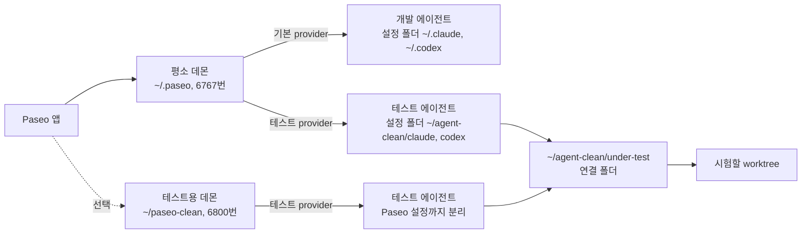

# 테스트 환경은 어떻게 동작하나

이 문서는 `tools/test-env/`의 테스트 환경이 **왜 필요한지**, **어떤 원리로 나뉘는지**, **쓸 때 무엇을
조심해야 하는지**를 처음 보는 사람도 따라올 수 있게 차례대로 설명한다. 명령을 빠르게 찾으려면
[`README.md`](README.md)를 보고, 원리를 알고 싶으면 이 문서를 본다.

설명은 Windows 기준이다. 경로에 나오는 `~`는 "내 사용자 폴더"를 뜻한다. 예를 들어 사용자 이름이
`kim`이면 `~`는 `C:\Users\kim`이다.

---

## 1. 먼저 알아야 할 낱말

뒤에서 계속 나오는 낱말이다. 모르는 낱말이 나오면 여기로 돌아온다.

**플러그인**
: Claude Code나 Codex에 기능을 더하는 파일 묶음이다. 이 저장소의 `plugins/liverock-toolkit/` 폴더가 하나의 플러그인이다.

**스킬**
: 플러그인 안에 들어 있는 작업 설명서 하나다. `SKILL.md`라는 파일로 되어 있고, 에이전트가 특정 일을 할 때 읽고 그대로 따른다. `liverock-toolkit`에는 `onboarding`, `experiment-planning` 같은 스킬 여섯 개가 있다.

**에이전트**
: 사람이 요청하면 스스로 파일을 읽고 명령을 실행해서 일을 해내는 AI 프로그램이다. Claude Code와 Codex가 에이전트다.

**프로세스**
: 컴퓨터에서 지금 실행 중인 프로그램 하나하나를 말한다. 같은 프로그램을 두 번 실행하면 프로세스가 두 개 생긴다.

**부모 프로세스, 자식 프로세스**
: 프로그램 A가 프로그램 B를 실행하면, A를 부모 프로세스, B를 자식 프로세스라고 부른다. 예를 들어 PowerShell 창에서 `claude`를 입력하면 PowerShell이 부모, Claude가 자식이다.

**설정 폴더(홈 폴더)**
: 프로그램이 자기 설정과 기록을 저장해 두는 폴더다. Claude Code는 기본으로 `~/.claude`를, Codex는 기본으로 `~/.codex`를 쓴다. "Claude 홈", "Codex 홈"이라고 부르기도 한다.

**환경변수**
: 프로세스마다 따로 가지고 있는 `이름=값` 목록이다. 프로그램은 실행될 때 이 목록을 읽어서 동작을 정한다. 자세한 원리는 3절에서 설명한다.

**`CLAUDE_CONFIG_DIR`**
: Claude Code가 읽는 환경변수 이름이다. 값으로 폴더 경로를 넣으면, Claude Code는 `~/.claude` 대신 그 폴더를 설정 폴더로 쓴다.

**`CODEX_HOME`**
: Codex가 읽는 환경변수 이름이다. 값으로 폴더 경로를 넣으면, Codex는 `~/.codex` 대신 그 폴더를 설정 폴더로 쓴다.

**Paseo**
: 여러 에이전트를 한 화면에서 만들고, 지켜보고, 관리하게 해 주는 프로그램이다. 데스크톱 앱과 명령줄 도구(`paseo` 명령)가 있다.

**데몬**
: 화면 없이 뒤에서 계속 실행되면서 요청을 기다리는 프로그램이다. Paseo 데몬은 "에이전트를 하나 만들어 줘"라는 요청을 받으면 Claude Code나 Codex 프로세스를 실행한다. 즉 에이전트의 부모 프로세스가 Paseo 데몬이다.

**포트**
: 한 컴퓨터 안에서 여러 프로그램이 통신을 받을 때, 어느 프로그램에게 온 연결인지 구분하는 번호다. 평소 쓰는 Paseo 데몬은 6767번, 테스트용 Paseo 데몬은 6800번을 쓴다.

**provider**
: Paseo가 에이전트를 만들 때 "어떤 프로그램을, 어떤 설정으로 실행할지"를 정한 항목이다. 기본으로 `claude`, `codex` provider가 있고, 사용자가 설정 파일에 새 provider를 더할 수 있다.

**작업 폴더(cwd)**
: 에이전트가 일을 시작하는 폴더다. 에이전트는 이 폴더의 파일을 기본 작업 대상으로 보고, 이 폴더에 있는 안내 파일(`CLAUDE.md`, `AGENTS.md`)도 읽는다. cwd는 current working directory의 줄임말이다.

**워크스페이스**
: Paseo가 "어느 폴더에서 작업하는지"를 기억해 두는 항목이다. 에이전트는 워크스페이스 하나에 속해서 실행된다.

**브랜치**
: git에서 같은 저장소의 서로 다른 작업 줄기를 부르는 이름이다. 예를 들어 `main`은 완성본, `feat/usage-panel`은 사용량 패널을 만드는 중인 작업이다.

**worktree**
: git 기능으로, 한 저장소의 여러 브랜치를 **서로 다른 폴더에 동시에** 꺼내 놓는 것이다. 이 저장소에서는 `LiveRockPlugins`, `LiveRockPlugins-usage-panel` 같은 폴더가 각각 다른 브랜치를 담은 worktree다.

**캐시**
: 프로그램이 빠르게 쓰려고 파일의 **복사본**을 저장해 두는 폴더다. 원본을 고쳐도 캐시에 있는 복사본은 저절로 바뀌지 않는다.

**연결 폴더(junction)**
: Windows 기능으로, 폴더처럼 보이지만 실제로는 다른 폴더를 가리키기만 하는 항목이다. 연결 폴더를 열면 가리키는 폴더의 내용이 그대로 보인다. 연결 폴더 안에는 파일이 따로 없다.

**인증 파일**
: 로그인했다는 정보를 저장한 파일이다. Claude Code는 설정 폴더 안의 `.credentials.json`, Codex는 설정 폴더 안의 `auth.json`에 저장한다.

---

## 2. 왜 테스트 환경을 따로 만드나

플러그인을 만드는 사람의 컴퓨터에는 **개발을 도와주는 플러그인**이 이미 설치되어 있다. 이 저장소를 만든
컴퓨터에는 `paseo-toolkit`이 설치되어 있다. 이 문서에서는 이렇게 평소 쓰는 환경을 **DEV**라고 부른다.

DEV에서 개발 중인 플러그인을 그대로 시험하면 두 가지 문제가 생긴다.

1. **이름이 겹친다.** `paseo-toolkit`과 `liverock-toolkit`에는 `agent-orchestration`, `profile-setup`처럼
   이름이 같은 스킬이 있다. 둘이 함께 로드되면, 에이전트가 어느 쪽 설명서를 따랐는지 알 수 없다.
2. **실제 사용자와 조건이 다르다.** 실제 사용자는 `liverock-toolkit`만 설치한다. DEV에서 시험하면 다른
   플러그인의 지시까지 섞인 결과가 나오므로, 사용자가 보게 될 결과와 다를 수 있다.

그래서 **개발 중인 플러그인 하나만 로드된 에이전트**를 따로 만들어 시험한다. 동시에 DEV는 한 글자도
바뀌지 않아야 한다. 개발은 DEV에서 계속해야 하기 때문이다.

---

## 3. 원리 1: 프로그램은 설정 폴더를 어디서 찾나

### 설정 폴더에 들어 있는 것

Claude Code의 설정 폴더(`~/.claude`)에는 다음이 들어 있다.

| 들어 있는 것 | 파일·폴더 | 하는 일 |
| --- | --- | --- |
| 로그인 정보 | `.credentials.json` | 어떤 계정으로 로그인했는지 |
| 설정 | `settings.json` | 어떤 플러그인을 켤지, 권한 규칙 등 |
| 설치한 플러그인 목록 | `plugins/installed_plugins.json` | 무엇을 설치했는지 |
| 설치한 플러그인 파일 | `plugins/cache/` | 설치할 때 복사해 둔 플러그인 파일 |
| 대화 기록 | `projects/` | 지난 대화 내용 |

Codex의 설정 폴더(`~/.codex`)도 구조가 비슷하다. 로그인 정보는 `auth.json`, 설정과 설치한 플러그인
목록은 `config.toml`, 설치한 플러그인 파일은 `plugins/cache/`에 있다.

즉 **"어떤 플러그인이 로드되는가"는 설정 폴더가 결정한다.**

### 설정 폴더를 바꾸는 방법: 환경변수

Claude Code는 시작할 때 `CLAUDE_CONFIG_DIR`라는 환경변수가 있는지 먼저 본다.

- 없으면 `~/.claude`를 설정 폴더로 쓴다.
- 있으면 그 값에 적힌 폴더를 설정 폴더로 쓰고, `~/.claude`는 전혀 읽지 않는다.

Codex도 같은 방식으로 `CODEX_HOME`을 본다.

그래서 이 테스트 환경은 **빈 설정 폴더**를 새로 만든다.

- `~/agent-clean/claude`: 테스트용 Claude 설정 폴더
- `~/agent-clean/codex`: 테스트용 Codex 설정 폴더

이 폴더로 실행한 Claude Code에는 DEV에 설치된 플러그인이 하나도 없다. DEV의 설치 목록은 `~/.claude`에
있는데, 이 프로세스는 그 폴더를 읽지 않기 때문이다.

### 그래서 로그인을 한 번 새로 해야 한다

로그인 정보도 설정 폴더 안에 있다. 새 설정 폴더에는 로그인 정보가 없으므로, 처음에 한 번 로그인해야 한다.
로그인하면 인증 파일은 새 설정 폴더 안에만 생기고, DEV의 인증 파일은 그대로다.

DEV의 인증 파일을 복사해서 로그인을 건너뛰면 안 된다. 두 환경이 같은 인증 파일을 나눠 쓰게 되어 분리가
깨지고, 인증 정보가 필요 없이 한 벌 더 생긴다.

### 새 설정 폴더에서도 보이는 것

다음은 설정 폴더와 관계없이 들어오므로, 테스트 에이전트에서 보여도 DEV가 섞인 것이 아니다.

- **Claude 계정에 붙은 스킬**(`anthropic-skills:*`): 설치 목록이 아니라 로그인한 계정을 따라온다.
- **Claude Code에 처음부터 들어 있는 스킬**(`code-review`, `init` 등): 프로그램 자체에 들어 있다.
- **Codex 사용자 공용 스킬**(`~/.agents/skills/` 폴더): Codex는 `CODEX_HOME`과 관계없이 이 폴더를 항상 읽는다.

---

## 4. 원리 2: 환경변수는 어떻게 전달되나

### 환경변수의 규칙

1. 프로세스는 각자 자기 환경변수 목록을 가진다.
2. 부모 프로세스가 자식 프로세스를 실행하면, 자식은 **실행되는 순간** 부모의 목록을 복사해서 받는다.
3. 복사가 끝난 뒤에는 서로 독립이다. 부모가 값을 바꿔도 이미 실행된 자식은 바뀌지 않는다.
4. PowerShell에서 `$env:이름 = "값"`으로 정한 값은 **그 창과, 그 창에서 새로 실행하는 프로그램에만** 적용된다.
   창을 닫으면 사라진다. 다른 창이나 이미 실행 중인 프로그램에는 영향이 없다.

그래서 로그인할 때 이렇게 입력한다.

```powershell
$env:CLAUDE_CONFIG_DIR = "$HOME\agent-clean\claude"; claude
```

앞부분이 이 창의 환경변수를 정하고, 뒷부분의 `claude`는 이 창의 자식이므로 그 값을 받는다. 다른 창에서
실행한 Claude Code는 여전히 DEV 설정을 쓴다.

### Paseo를 거칠 때는 어떻게 되나

Paseo 앱에서 에이전트를 만들면, 실제로 Claude Code를 실행하는 것은 **Paseo 데몬**이다. 에이전트는 데몬의
자식 프로세스다. 그러면 에이전트의 환경변수는 두 곳에서 온다.

1. 데몬이 가진 환경변수(데몬이 실행될 때 받은 것)
2. provider 설정의 `env` 항목에 적은 값(데몬이 자식을 실행할 때 덧붙인다)

이 테스트 환경은 2번을 쓴다. provider 설정에 `CLAUDE_CONFIG_DIR`를 적어 두면, 그 provider로 만든 에이전트에만
그 값이 들어간다. 같은 데몬에서 기본 `claude` provider로 만든 에이전트는 이 값을 받지 않으므로 DEV 설정을 쓴다.
**그래서 한 데몬 안에서 개발 에이전트와 테스트 에이전트가 동시에 돌 수 있다.**

### PATH: 프로그램을 찾는 환경변수

`PATH`는 "프로그램을 찾아볼 폴더 목록"을 담은 환경변수다. `claude`라고만 입력해도 실행되는 이유는, 컴퓨터가
`PATH`에 적힌 폴더들을 차례로 뒤져서 `claude.exe`를 찾기 때문이다.

데몬도 시작할 때 부모의 `PATH`를 복사해 받는다. 그래서 `PATH`가 짧은 창(예: 일부 Git Bash 창)에서 데몬을
시작하면, 데몬이 `claude`나 `codex`를 찾지 못한다. `paseo daemon status`에 `not found`가 나오면 이 경우다.
PowerShell 창에서 데몬을 다시 시작하면 된다.

---

## 5. 원리 3: 플러그인을 에이전트에 올리는 두 가지 방법

### 방법 A: 설치

`claude plugin install`이나 `codex plugin add`로 설치하면, 프로그램이 플러그인 파일을 **설정 폴더의 캐시로
복사**한다. 그 뒤로는 복사본을 읽는다.

- 좋은 점: 실제 사용자가 쓰는 방식과 같다.
- 문제: 원본 파일을 고쳐도 복사본은 그대로다. 고칠 때마다 다시 설치해야 한다.

### 방법 B: 폴더를 직접 지정

Claude Code는 `--plugin-dir <폴더>` 옵션을 받는다. 이렇게 실행하면 설치하지 않고 **그 폴더를 직접 읽는다.**

- 좋은 점: 원본을 고치고 새 에이전트를 만들면 바로 반영된다.
- 조건: 그 실행 한 번에만 적용된다. 그래서 매번 이 옵션을 붙여서 실행해야 한다. 4절의 provider 설정이 이것을 대신 해 준다.

### 두 프로그램의 차이

| | Claude Code | Codex |
| --- | --- | --- |
| 폴더를 직접 지정하는 옵션 | 있음(`--plugin-dir`) | 없음 |
| 이 테스트 환경이 쓰는 방법 | 방법 B | 방법 A |
| 원본을 고친 뒤 할 일 | 새 에이전트 만들기 | `setup.ps1 -SyncCodex`로 다시 설치한 뒤 새 에이전트 만들기 |

Codex는 방법 B가 없어서 방법 A를 쓴다. `setup.ps1 -SyncCodex`는 캐시의 복사본을 원본으로 덮어쓰는 명령이다.
같은 버전 번호여도 덮어쓴다.

### 테스트 설정 폴더에 같은 플러그인을 설치하면 안 되는 이유

Claude 테스트 설정 폴더에 `liverock-toolkit`을 **설치까지** 해 두면, 방법 A의 복사본과 방법 B의 원본이 함께
로드된다. 같은 플러그인이 두 벌이 되어 어느 쪽이 쓰였는지 알 수 없다. 이미 설치했다면 끈다(`claude plugin disable`).

---

## 6. 원리 4: Paseo provider로 한 번에 묶기

3~5절의 설정(설정 폴더, 플러그인 폴더)을 매번 입력하지 않으려고, Paseo 설정 파일(`~/.paseo/config.json`)에
**테스트 전용 provider**를 넣어 둔다. 실제 내용은 다음과 같다.

```json
"claude-liverock-toolkit-test": {
  "extends": "claude",
  "label": "Claude (liverock-toolkit test)",
  "command": ["<claude.exe 경로>", "--plugin-dir", "~/agent-clean/under-test/plugins/liverock-toolkit"],
  "env": { "CLAUDE_CONFIG_DIR": "~/agent-clean/claude" }
}
```

한 줄씩 보면 이렇다.

- `"claude-liverock-toolkit-test"`: 이 provider의 이름이다. 명령줄에서 `--provider` 뒤에 쓴다.
- `"extends": "claude"`: 기본 `claude` provider의 설정을 그대로 가져오고, 아래에 적은 것만 바꾼다는 뜻이다.
- `"label"`: Paseo 앱의 목록에 보이는 이름이다.
- `"command"`: 에이전트를 만들 때 실행할 명령이다. `--plugin-dir`로 플러그인 폴더를 직접 지정한다(5절 방법 B).
- `"env"`: 이 provider로 만든 에이전트에만 덧붙일 환경변수다. 설정 폴더를 테스트용으로 바꾼다(3·4절).

Codex용 provider(`codex-liverock-toolkit-test`)는 `command`를 바꾸지 않는다. `env`에 `CODEX_HOME`만 적는다.
플러그인은 테스트용 Codex 설정 폴더에 설치해 두었기 때문이다(5절 방법 A).

이렇게 해 두면 Paseo 앱에서 에이전트를 만들 때 provider만 바꿔 고르면 된다.

- 기본 `Claude`를 고르면 DEV 설정으로 개발 에이전트가 뜬다.
- `Claude (liverock-toolkit test)`를 고르면 테스트 설정으로 테스트 에이전트가 뜬다.

---

## 7. 원리 5: 연결 폴더로 시험 대상 바꾸기

### 생긴 문제

이 저장소는 기능마다 worktree를 따로 쓴다. 사용량 패널 작업은 `LiveRockPlugins-usage-panel` 폴더에 있다.
그런데 provider의 `--plugin-dir`에 폴더 하나를 적어 두면, 다른 worktree에서 고친 것은 시험할 수 없다.
시험할 worktree가 바뀔 때마다 Paseo 설정 파일을 고치는 것은 번거롭고, 실수로 DEV 설정을 망가뜨릴 위험도 있다.

### 해결: 연결 폴더

`~/agent-clean/under-test`라는 **연결 폴더**를 하나 만들고, provider는 항상 이 폴더만 보게 한다.

```
provider ──> ~/agent-clean/under-test  ──(가리킴)──>  지금 시험할 worktree 폴더
                                                      (예: LiveRockPlugins-usage-panel)
```

시험할 worktree를 바꿀 때는 Paseo 설정을 건드리지 않고 연결만 바꾼다.

```powershell
pwsh tools/test-env/setup.ps1 -Target ..\LiveRockPlugins-usage-panel
```

지금 무엇에 연결되어 있는지는 이렇게 본다.

```powershell
(Get-Item ~/agent-clean/under-test).Target
```

### 연결 폴더를 다룰 때 조심할 점

- **연결은 하나뿐이다.** 한 번에 한 worktree만 시험할 수 있다. 연결을 바꾸면 평소 데몬과 테스트용 데몬
  양쪽의 테스트 provider가 함께 바뀐다.
- **지울 때 조심한다.** 연결 폴더를 "안에 있는 것까지 전부 지우기"(재귀 삭제)로 지우면, 가리키는 **실제
  worktree의 파일까지 지워질 수 있다.** 연결만 지우려면 `[System.IO.Directory]::Delete(<경로>)`처럼 안의 내용을
  지우지 않는 방식을 쓴다. `setup.ps1`은 이 방식으로 연결을 바꾸고, 그 자리에 실제 폴더가 있으면 아무것도
  지우지 않고 멈춘다.
- **Codex는 연결을 풀어서 기록한다.** Codex는 설치할 때 연결 폴더가 가리키는 실제 경로를 기록한다. 그래서
  `-SyncCodex`는 매번 등록을 지우고 다시 등록한다.

---

## 8. 원리 6: 에이전트 안에서 테스트 에이전트를 만들 때

개발 에이전트에게 "테스트 에이전트를 띄워 줘"라고 시키면, 개발 에이전트가 `paseo run` 명령을 실행한다.
이때 한 가지 함정이 있다.

Paseo가 만든 에이전트의 환경변수에는 다음 값이 들어 있다.

- `PASEO_AGENT_ID`: 이 에이전트의 번호
- `PASEO_AGENT_CWD`: 이 에이전트의 작업 폴더
- `PASEO_HOME`: 이 에이전트를 만든 데몬의 설정 폴더

`paseo run`은 이 값이 있으면 "에이전트가 자기 아래에 에이전트를 하나 더 만드는구나"라고 판단한다. 그러면
`--cwd`로 지정한 폴더를 무시하고, **부른 에이전트의 작업 폴더(보통 개발 저장소)**에서 테스트 에이전트를 만든다.
그러면 테스트 에이전트가 개발 저장소의 `CLAUDE.md`, `AGENTS.md`, 개발용 스킬을 읽어서 격리가 깨진다.
더 곤란한 점은, 로드된 플러그인 목록은 정상으로 보여서 목록만 봐서는 이 문제를 알아챌 수 없다는 것이다.

그래서 테스트 에이전트를 만들 때는 이 값을 비운 창에서 실행하고, 만든 뒤 작업 폴더를 직접 확인한다.

```powershell
pwsh -NoProfile -Command {
  $env:PASEO_AGENT_ID = $null; $env:PASEO_AGENT_CWD = $null
  paseo run -d --provider claude-liverock-toolkit-test --cwd $HOME\plugin-testproj "<요청>"
}
paseo agent inspect <에이전트 번호>      # Cwd 줄이 plugin-testproj 인지 본다
```

값을 비우는 데 `Remove-Item Env:...`를 쓰지 않는 이유도 있다. 뒤에 오는 요청이 `/`로 시작하면(예:
`/liverock-toolkit:experiment-planning`) Claude Code의 보호 기능이 이 명령 전체를 "시스템 경로 삭제"로 보고 막는다.

---

## 9. 전체 구성



| 무엇 | 어디에 | 설명 |
| --- | --- | --- |
| 평소 Claude 설정 | `~/.claude` | 건드리지 않는다 |
| 평소 Codex 설정 | `~/.codex` | 건드리지 않는다 |
| 평소 Paseo 설정 | `~/.paseo/config.json` | 처음에 테스트 provider 항목만 한 번 더한다 |
| 테스트 Claude 설정 | `~/agent-clean/claude` | 로그인 정보만 있고 플러그인은 설치하지 않는다 |
| 테스트 Codex 설정 | `~/agent-clean/codex` | 로그인 정보와 `liverock-toolkit` 설치본 |
| 연결 폴더 | `~/agent-clean/under-test` | 시험할 worktree를 가리킨다 |
| 테스트용 Paseo 데몬 | `~/paseo-clean` | 선택 사항. 6800번 포트 |
| 시험용 빈 프로젝트 | `~/plugin-testproj` | 테스트 에이전트의 작업 폴더 |

### 테스트용 데몬은 언제 쓰나

평소 데몬에 테스트 provider를 넣으면, Claude와 Codex 쪽은 분리되지만 **Paseo 쪽 설정은 평소 것을 함께 쓴다.**
Paseo 쪽 설정이란 에이전트 프로필, 설치된 Paseo 플러그인, 모든 에이전트에 붙는 추가 지시(`appendSystemPrompt`),
워크스페이스 목록이다.

시험하는 스킬의 동작이 이 Paseo 쪽 상태에 따라 달라지면, 테스트용 데몬에서 시험해야 실제 사용자 조건과 같아진다.
예를 들어 "Paseo 플러그인이 설치돼 있지 않으면 설치 방법을 안내한다"는 스킬은, 평소 데몬에 이미 그 플러그인이
있으면 안내하는 부분을 시험할 수 없다.

---

## 10. 사용하는 순서

### 처음 한 번

1. `pwsh tools/test-env/setup.ps1`을 실행한다. 테스트 설정 폴더, 연결 폴더, 테스트용 데몬 설정이 만들어지고,
   평소 Paseo 설정에 넣을 provider 항목이 화면에 출력된다.
2. 테스트 설정 폴더로 Claude에 로그인한다.
   `$env:CLAUDE_CONFIG_DIR = "$HOME\agent-clean\claude"; claude`를 실행하고 `/login`, 끝나면 `/exit`.
3. 테스트 설정 폴더로 Codex에 로그인한다. `$env:CODEX_HOME = "$HOME\agent-clean\codex"; codex login`.
4. Codex에 플러그인을 설치한다. `pwsh tools/test-env/setup.ps1 -SyncCodex`.
5. 1번에서 출력된 provider 항목을 `~/.paseo/config.json`에 넣고 `paseo daemon reload`를 실행한다.
   `reload`는 데몬을 끄지 않고 설정 파일만 다시 읽게 하는 명령이다.
6. `paseo provider ls`에 테스트 provider 두 개가 `available`로 나오면 준비가 끝난 것이다.

### 시험할 때마다

1. 시험할 worktree가 연결되어 있는지 보고, 아니면 `setup.ps1 -Target <worktree>`로 바꾼다.
2. Codex로 시험하면 `setup.ps1 -SyncCodex`를 실행한다.
3. Paseo 앱에서 테스트 provider로 **새** 에이전트를 만든다. 이미 떠 있는 에이전트에는 고친 내용이 반영되지 않는다.
   에이전트는 시작할 때 플러그인을 한 번 읽고 그 뒤로는 다시 읽지 않기 때문이다.
4. 개발 에이전트에게 "○○ 스킬로 테스트 환경에서 실행해봐"라고 하면, 개발 전용 스킬 `plugin-test-env`가 1~3번과
   결과 판정, 정리까지 대신 한다.

---

## 11. 주의점 모음

| 주의점 | 이유 |
| --- | --- |
| 평소 설정 폴더(`~/.claude`, `~/.codex`, `~/.paseo`)는 provider를 더하는 것 말고 고치지 않는다 | 개발 환경이 바뀌면 개발도, 시험 결과도 믿을 수 없게 된다 |
| DEV 인증 파일을 테스트 폴더로 복사하지 않는다 | 분리가 깨지고 인증 정보가 한 벌 더 생긴다 |
| 테스트 Claude 설정에 개발 중인 플러그인을 설치하지 않는다 | `--plugin-dir`과 겹쳐 같은 플러그인이 두 벌 로드된다 |
| 고친 뒤에는 항상 새 에이전트로 시험한다 | 실행 중인 에이전트는 시작할 때 읽은 플러그인을 계속 쓴다 |
| Codex는 고친 뒤 `-SyncCodex`를 실행한다 | Codex는 캐시의 복사본을 읽는다 |
| 연결 폴더를 재귀 삭제로 지우지 않는다 | 가리키는 실제 worktree 파일이 지워질 수 있다 |
| 연결을 바꾸면 끝난 뒤 원래대로 돌려놓는다 | 연결은 하나뿐이고 모든 테스트 provider가 함께 본다 |
| 에이전트 안에서 `paseo run`을 할 때는 `PASEO_AGENT_ID`, `PASEO_AGENT_CWD`를 비운다 | 비우지 않으면 `--cwd`가 무시되고 개발 저장소에서 뜬다 |
| 만든 뒤 `paseo agent inspect`로 작업 폴더를 확인한다 | 플러그인 목록만으로는 작업 폴더가 잘못된 것을 알 수 없다 |
| 테스트 에이전트를 권한 확인을 건너뛰는 모드로 띄우지 않는다 | 실제 사용자는 권한 확인을 받으므로 조건이 달라진다 |
| 데몬은 PowerShell 창에서 시작한다 | 데몬이 창의 `PATH`를 받아야 `claude`, `codex`를 찾는다 |
| 시험이 끝나면 테스트 에이전트와 워크스페이스를 정리(archive)한다 | `paseo run`은 실행할 때마다 워크스페이스를 새로 만든다 |

---

## 12. 문제가 생겼을 때

| 보이는 증상 | 원인 | 확인·해결 |
| --- | --- | --- |
| `Not logged in · Please run /login` | 테스트 설정 폴더에 로그인 정보가 없다 | 10절 "처음 한 번"의 2번을 한다 |
| `CODEX_HOME points to ... but that path does not exist` | 테스트 Codex 설정 폴더가 아직 없다 | `setup.ps1`을 먼저 실행해 폴더를 만든 뒤 로그인한다 |
| `paseo daemon status`에 Claude/Codex가 `not found` | 데몬이 받은 `PATH`에 프로그램 폴더가 없다 | PowerShell 창에서 데몬을 다시 시작한다 |
| 테스트 에이전트에 DEV 플러그인(`paseo-toolkit`)이 보인다 | 테스트 provider가 아니라 기본 provider로 만들었거나, provider의 `env`가 빠졌다 | provider 이름과 `~/.paseo/config.json`의 `env`를 확인한다 |
| 고쳤는데 테스트 에이전트에 반영이 안 된다 | 이미 떠 있던 에이전트를 썼거나, 연결이 다른 worktree를 가리키거나, Codex 캐시가 예전 것이다 | 새 에이전트를 만든다. 연결 대상을 확인한다. Codex면 `-SyncCodex`를 실행한다 |
| 테스트 에이전트의 작업 폴더가 개발 저장소다 | 8절의 `PASEO_AGENT_ID` 문제 | 값을 비운 창에서 다시 만든다 |
| `Caller agent ... not found` | 테스트용 데몬에 명령을 보내면서 `PASEO_*` 값을 비우지 않았다 | `PASEO_AGENT_ID`, `PASEO_AGENT_CWD`, `PASEO_HOME`을 비우고 `--host 127.0.0.1:6800`을 붙인다 |
| 같은 플러그인 스킬이 두 번 보인다 | 테스트 Claude 설정에 같은 플러그인을 설치했다 | 그 설치를 끈다(`claude plugin disable`) |
